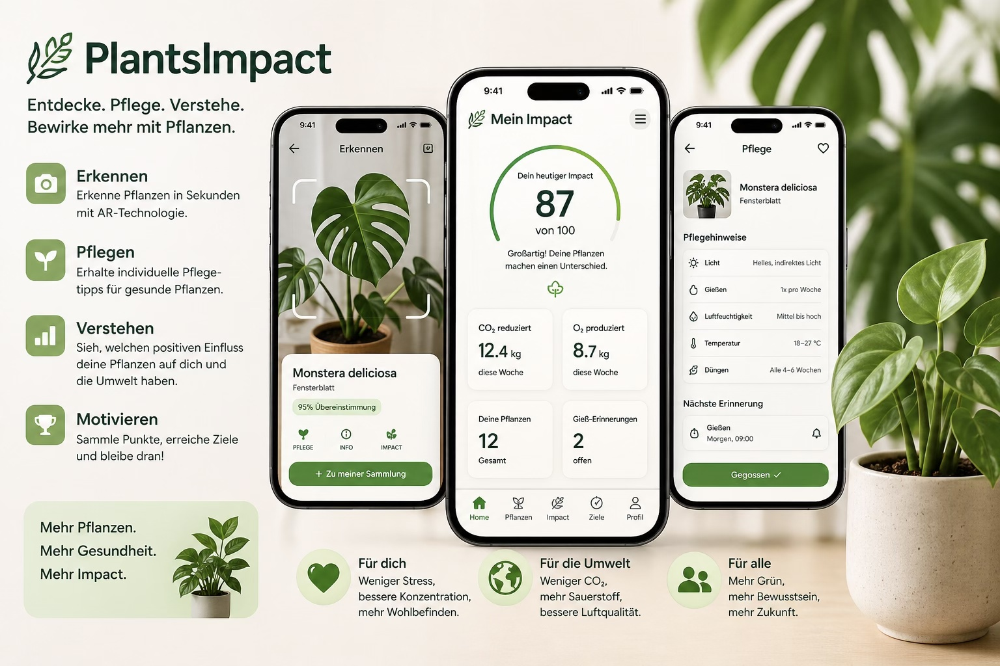

# PlantsImpact

PlantsImpact is a mobile-first MVP prototype developed for the ucdRE course, combining Requirements Engineering and User-Centered Design.



*Overview of the PlantsImpact MVP prototype, illustrating plant discovery, impact visualization, plant management, and user motivation features.*

The prototype helps users explore the estimated long-term positive impact of plants through a simple and motivating experience.

## Project Status

The main development work and Requirements Engineering deliverables are complete. The project is currently in the final submission phase of the ucdRE course.

Users can:

- Add plants through search or a prototype camera scan
- Store plants locally in a personal plant list
- View estimated impact over 1, 2, 5, and 10 years
- Explore lightweight social motivation through Friends and Leaderboard views
- Provide structured MVP feedback through an integrated feedback form

The prototype intentionally keeps a minimal and realistic MVP scope for validation and archival purposes.

## MVP Focus

PlantsImpact focuses on four core interactions:

1. Add a plant
2. View personal plants
3. Explore long-term impact
4. Stay motivated through visible progress and social comparison

The application intentionally avoids complex systems such as:

- Authentication
- Real backend infrastructure
- Real AR or AI plant recognition
- Advanced gamification systems
- Group systems
- Video tutorials
- Care reminder systems

This keeps the project focused on validating core Requirements Engineering assumptions and User-Centered Design interactions.

## Project Journey

PlantsImpact began as an open sustainability idea about making the positive effects of plants more visible. Through brainstorming, interviews, personas, validation activities, and requirements refinement, the team narrowed that broad topic into a focused MVP for exploring estimated long-term plant impact.

The prototype evolved iteratively as findings from User-Centered Design activities informed the requirements and interface. The team continuously reviewed priorities, reduced scope, and concentrated on the smallest set of core features needed to create a realistic and testable user flow.

Many ideas, including authentication, real plant recognition, advanced gamification, groups, tutorials, and care reminders, were intentionally postponed to avoid feature creep and keep the MVP aligned with user needs. This project was developed as part of the ucdRE course to apply Requirements Engineering and User-Centered Design methods in practice.

## Technology

- Astro
- TypeScript
- React components
- Tailwind CSS
- PWA support
- Local storage persistence
- Netlify deployment

## Run locally

Install dependencies and start the Astro development server:

```sh
npm install
npm run dev
```

Open the local URL shown by Astro. By default, it is:

```text
http://localhost:4321
```

## Build

Create a production build and preview it locally:

```sh
npm run build
npm run preview
```

Production output is generated in:

```text
dist/
```

## PWA Setup

- Static manifest: `public/manifest.webmanifest`
- Production manifest and service worker generated with `vite-plugin-pwa`
- Offline support through cached assets and local storage
- Runtime icons in `public/`

## Deploy to Netlify

- Build command: `npm run build`
- Publish directory: `dist`

No backend is required.

## Feedback

The prototype includes a lightweight integrated feedback flow using Google Forms to support ucdRE validation and usability testing.

## Sustainable Development Goals

PlantsImpact relates to the United Nations Sustainable Development Goals (SDGs), especially:

- SDG 13 – Climate Action
- SDG 3 – Good Health and Well-being
